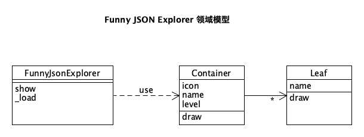

# Funny JSON Explorer

Funny JSON Explorer（**FJE**），是一个JSON文件可视化的命令行界面小工具

```shell
fje -f <json file> -s <style> -i <icon family>
```

```
{
    oranges: {
        'mandarin': {                            ├─ oranges
            clementine: null,                    │  └─ mandarin
            tangerine: 'cheap & juicy!'  -=>     │     ├─ clementine
        }                                        │     └─ tangerine: cheap & juicy!
    },                                           └─ apples
    apples: {                                       ├─ gala
        'gala': null,                               └─ pink lady
        'pink lady': null
    }
}
````

FJE可以快速切换**风格**（style），包括：树形（tree）、矩形（rectangle）；

```

├─ oranges                             ┌─ oranges ───────────────────────────────┐
│  └─ mandarin                         │  ├─ mandarin ───────────────────────────┤
│     ├─ clementine                    │  │  ├─ clementine ──────────────────────┤
│     └─ tangerine: cheap & juicy!     │  │  ├─ tangerine: cheap & juicy! ───────┤
└─ apples                              ├─ apples ────────────────────────────────┤
   └─ gala                             └──┴─✩gala ───────────────────────────────┘

        树形（tree）                                   矩形（rectangle）
````

也可以指定**图标族**（icon family），为中间节点或叶节点指定一套icon

```
├─♢oranges                                 
│  └─♢mandarin                             
│     ├─♤clementine                        
│     └─♤tangerine: cheap & juicy!    
└─♢apples                                  
   └─♤gala                                 

poker-face-icon-family: 中间节点icon：♢ 叶节点icon：♤                 
```


## 领域模型




## 作业要求

基于上述需求描述和领域模型，按照设计模式要求，进行软件设计，并编码实现（任何语言均可）。

### 设计模式

使用**工厂方法**（Factory）、**抽象工厂**（Abstract Factory）、**建造者**（Builder）模式、**组合模式**（Composition），完成功能的同时，使得程序易于扩展和维护。
1. （必做）：不改变现有代码，只需添加新的抽象工厂，即可添加新的风格
2. （选做）：通过配置文件，可添加新的图标族

### 作业提交
1. 设计文档：类图与说明，说明使用的设计模式及作用
2. 运行截图：两种风格，两种图标族，共计4次运行fje的屏幕截图
3. 源代码库：公开可访问的Github repo URL


## 参考资料

1. unicode 制表符与图标： https://unicode.yunser.com/