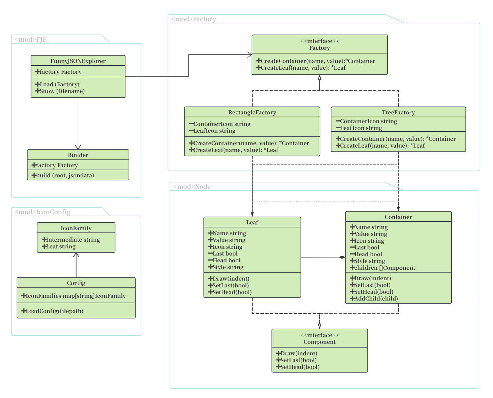

## FJE-GO：一个JSON文件可视化的命令行界面小工具

#### DirTree:


#### **运行方式：**

```bash
$ fje-go -f <json file> -s <style> -i <icon family> -help <help>
```
**`-f`指定进行可视化转换的JSON源文件路径**

**`-s`可以快速切换风格（style），包括：树形（tree）、矩形（rectangle）:**

**`-i`指定进行可视化转换的JSON源文件路径**

**`-help`查看Options帮助**


```
├─ oranges                             ┌─ oranges ───────────────────────────────┐
│  └─ mandarin                         │  ├─ mandarin ───────────────────────────┤
│     ├─ clementine                    │  │  ├─ clementine ──────────────────────┤
│     └─ tangerine: cheap & juicy!     │  │  ├─ tangerine: cheap & juicy! ───────┤
└─ apples                              ├─ apples ────────────────────────────────┤
   └─ gala                             └──┴─gala ────────────────────────────────┘

        树形（tree）                                   矩形（rectangle）
```

**`-i`可以指定图标族（icon family），为中间节点或叶节点指定一套icon**：

```
├─♢oranges                                 
│  └─♢mandarin                             
│     ├─♤clementine                        
│     └─♤tangerine: cheap & juicy!    
└─♢apples                                  
   └─♤gala                                 

Using IconFamily: poker-face
中间节点: ♢     叶子节点: ♤  
```

**可以在[src/config/icon_config.json](src/config/icon_config.json)下配置图标族**

**可以在[src/json](src/json)下配置需要可视化的JSON文件**

#### UML-类图：



#### 效果展示：

> JSON文件为 json/test_long.json


